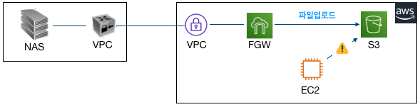
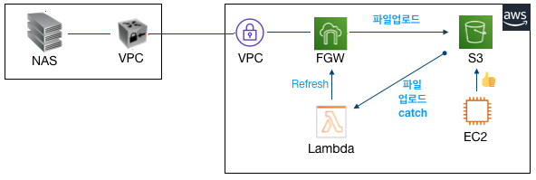

# Classic ASP 소스수정없이 S3 사용하기 using FileGateway

안녕하세요.
TechLab에서 문제은행 고도화 프로젝트를 담당하고 있는 이병철 입니다.
최근에 AS-IS 시스템 일부를 On-Premise에서  클라우드(AWS)로 전환시키려고 프로젝트를 진행하고 있습니다.


기존(On-Premise)에서 NAS를 이용하고 있었는데 무려 14TB정도 있었고 이 파일을 전부 AWS S3로 이관 해야 했습니다.  :pensive:
물론 이관이야 AWS Sync 를 통해서 이관하면 되겠지만 문제는 기존 소스(Classic ASP)에서 소스 변경없이 S3를 이용해야 한다는 점입니다. 
제약사항이 있다보니 방법을 찾아야 했고 여러가지 고민끝에 **AWS FileGateWay**를 이용하기로 결정했습니다. 
파일게이트웨이는 저희가 처음 작업해본거라서 사례를 많이 찾아봤지만 거의 없어서 AWS docs에 의존해야 했고 어떻게 구동하는지 어떻게하면 되는건지 문서를 꼼꼼히 살펴보는거 뿐이었습니다.
AWS 에서 **On-Premise에서 VM을 올릴경우**와 **AWS 에서 VM을 올릴경우** 두가지를 제시해서 저희는 향후 사용중지가 가능하고 비용절약을 위해 AWS에 EC2를 두어 VM을 올리기로 했습니다.

**요구사항**

- 범용 M5.2xlarge 또는 최적화 C5.2xlarge 정도
- EBS Root Volume 350GiB 이상
- 인바운드 UDP 445, 139, TCP 80, 22, 139, 445
- 아웃바운드 전체

**권장**

- 루트 디스크: 80GB io1, 4,000IOPS
- 캐시 디스크: 512GiB EBS 캐시, io1, 1,500 프로비저닝된 IOPS
- 최소 네트워크 성능: 1Gbps
- Amazon EC2 인스턴스: c5.4xlarge

생각보다 AWS에서 정의된 포트가 많이 필요하네요. 저희는 필요 포트를 잡아서 정리해 두었습니다. 
그리고 권장성능 사양이 너무 높아서 저희는 최소한의 테스트로 사용가능한 인스턴스 사이즈를 측정하기로 했습니다. 

이제 성능분석을 했으니 어느정도 목표성능을 파악해서 비교분석을 해야 할때 입니다. 


위 산정근거와 부하테스트를 근거로 다음과 같은 결론이 났습니다. 

- 동시에 읽기,삭제,쓰기를 실행하는 task를 500개까지 증가하여 부하테스트를 수행한결과 성능상 큰 차이는 없음.(쓰기속도는비례적으로감소)
- OS의 커널 파라미터 수정없이 클라이언트 100개까지만 테스트 가능
- 부하 클라이언트 1,000개이상부터는 WAS서버의 성능 문제 발생,  1,000개이상의 성능이 필요한 경우 파일게이트웨이의 사양 증설이 필요할 것으로 예측됨

### FileGateWay 연결하기

EC2(M5.2xlarge) 를 생성하고 그안에 VM으로 FileGateway 연결습니다. EC2에 넣다 보니 기존 NAS 와 어떻게 연결할건지 궁금하실텐데요. 
아래 그림과 같이 기존 웹서비스와 새로 구축될 서비스를 모두 S3를 사용하게끔 구성했습니다.


	* 기존 IDC 서비스에서 파일을 업로드 하거나 다운로드시 NAS 경로 이용 (SMB 또는 NFS)
	* AWS 웹서비스 이용시 S3를 이용

### 파일 동기화 이슈발생


여기서 한가지 이슈가 발생했습니다.
FileGateway 로 저장된 파일은 EC2에서 보이지 않는 현상이 발생했습니다. 물론 반대적인 현상도 마찬가지 였습니다. 
이 경우 AWS 에서**Refresh Cache** 를 해주면 된다고 되어 있습니다. 그래서 Lambda를 파일업로드 이벤트를 Catch해서 Refresh Cache를 하기로 했습니다. 

```java
public class FilegatewayRefreshHandler implements RequestHandler<S3Event, String> {
    @Override
    public String handleRequest(S3Event event, Context context) {
    	AWSStorageGateway client = AWSStorageGatewayClientBuilder.standard().build();
    	RefreshCacheRequest refreshCacheRequest = new RefreshCacheRequest();
    	refreshCacheRequest.setFileShareARN(“S3-ARN-주소”);
        client.refreshCache(refreshCacheRequest);
    	context.getLogger().log(“FilegatewayRefreshHandler executed:::”);
        return “SUCCESS”;
    }
}
```

물론 Java로 구현했고 Jar파일로 만들어서 **Lambda**(제한시간 10초)에서 실행을 하도록 구현했습니다.


이 부분은 이렇게 해서 해결을 보았습니다. 해결을 보았다기 보다는 일단 Refresh cache를 했을때 파일정보를 가지고 올수 있어서 해결이 된것 같이 보였습니다. 
그 다음엔 의문점이 들었던거죠. 과연 다량의 파일을 업로드 했을때 Refresh cache를 보내면 잘 될까 :question:
그래서 성능분석을 하기 시작했습니다. 

### Refresh Cache 성능분석 하기

성능분석은 의외로 간단하게 했고 결과는 참혹했습니다. 


**실패 목록** 

- Too many requests have been sent to server. (InvalidGatewayRequestException)
- The specified gateway proxy network connection is busy. (InvalidGatewayRequestException)
- Rate exceeded (ThrottlingException)
- timed out

위에 표를 보시면 아시겠지만 성공률은 최악이었고 왜그럴까? root 에서 작업을 하느라 이러한 현상이 발생한것 같아서 하위폴더구조로 변경했습니다. 
하위 파일갯수가 가장많은 13개 폴더를 가지고 와서 Refresh Cache 테스트를 진행했습니다.

답이 없어보여서 AWS TAM(Technical Account Manager :boy: )에게 문의했습니다.  


아하~!! 
그냥 S3에 넣지 말고 FileGateway 에 넣으면 되겠구나? 그래서 방법을 변경했습니다. 성능분석했던 결과는 추억속으로 사라지고…
실시간 파일의 경우 FileGateway 에 넣고 문제없이 해결이 되나 싶었습니다.

### 2차 이슈발생

위 이슈를 해결하고 한동안 서비스 개발을 계속 진행하고 있었는데 또 다른 이슈가 발생했습니다. 
FileGateway 를 통해서 **파일을 업로드 하고 있는데 그안에 객체가 1만개이상있는곳에서 업로드 속도저하 현상**이 발생하는겁니다. 

- 파일/디렉토리가 많지 않은 경로에서는 파일 업로드 지연 현상은 발견되지 않았음. **평균 약 3초**
- 파일/디렉토리가 많은 경로에서는 지연 현상이 발생됨. **평균 약 1분 46초**
  ![이미지5]


아무리 파일 갯수(1만개이상)가 많아도 업로드의 경우 저장하려는 파일의 하위폴더를 잡고 저장을 하는데 왜 느린거지? 
클라우드와치로 성능분석을 해보았으나 크게 문제될만한 부분은 안보였습니다. 
의구심은 또 의구심을 낳고 이건 뭐좀 하려면 이슈가 발생을 하니 난감합니다. 하지만 해결은 해야하니 다음과 같이 TAM :boy:  에게 또 문의했습니다. 이거 왜이래? 도와줘요~ Tam~!!!!


핵심은 전체파일갯수를 줄이지 않는다면 성능이 안난다고 하네요. 저희가 보유중인 파일갯수는 **4천2백만개**정도 입니다. 
이러면 파일게이트웨이에서 탈출을 해야 할듯 합니다.  그럼 대안으로 뭐가 있는지 확인해 보았습니다. 
다시 원점에서 시작하려니 갑갑하긴 했지만 프로젝트 기간이 얼마남지 않아서 빠르게 대처해 보았습니다. 
일단 파일게이트웨이는 최소한도로 이용하면서 방향을 선회한다. 라는 조건이 있었습니다. 
파일용량이 많은 부분부터 API 전환작업을 시작하는걸로 해서 순차적으로 AS-IS 프로젝트의 프로그램을 수정하는걸로 결정을 냈습니다. 
공용 버킷을 두어서 계정이 필요없는 서비스의 경우 Public 하게 처리하는걸로 진행했구요. 


### 마치며

AWS 파일게이트웨이 온프레미스 환경사용자를 위해서 만들어 놓은 서비스이긴 한데 대용량 컨텐츠를 서비스 하고 있는 회사에겐 맞지 않는듯 합니다. 
물론 처음으로 S3를 이용하고 싶다 라고 생각하시는 분께는 추천을 드리지만 이용자가 많거나 컨텐츠 용량이 많다면 API방식을 이용하든지 public S3를 이용하시는 편이 좋을것 같네요.
성능 이슈만 없다면 이용해 볼만 합니다. 언제쯤 개선이 될지 모르겠지만 현재로썬 아닌듯 합니다. 
부족한 글 읽어 주셔서 감사합니다. 

**참고자료** 

- AWS FileGateWay 설명 https://docs.aws.amazon.com/ko_kr/storagegateway/latest/userguide/WhatIsStorageGateway.html
- AWS FileGateWay 성능지침 https://docs.aws.amazon.com/ko_kr/storagegateway/latest/userguide/Performance.html